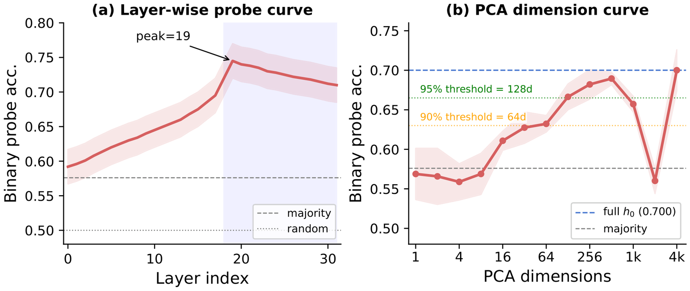
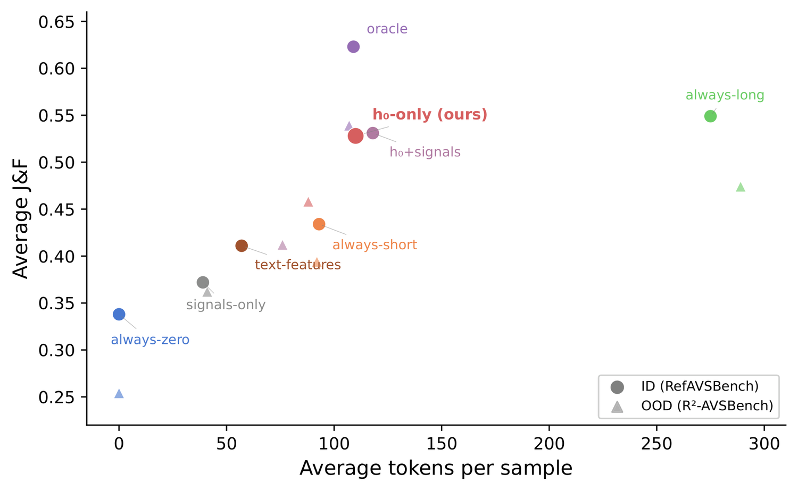
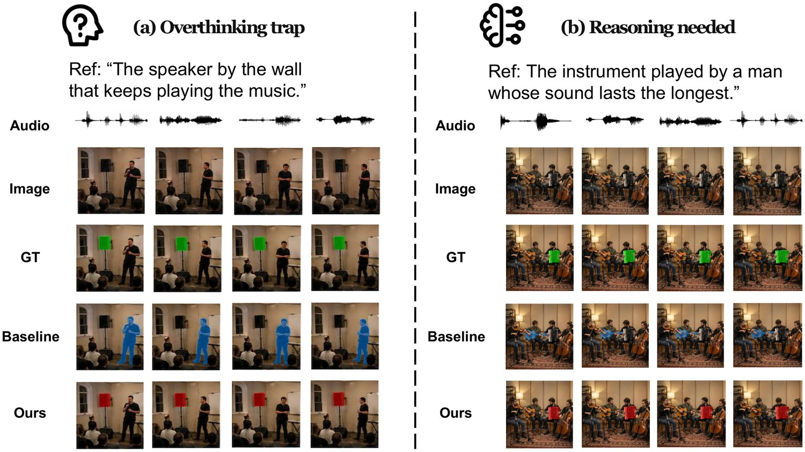

<div align="center">

# To Think or Not to Think

### Pre-Decisional Reasoning Budgets for Referring Audio-Visual Segmentation

[](#installation)
[](#installation)
[](#overview)
[](#key-results)
[](https://github.com/Jackey0903/To-Think-or-Not-to-Think)
[](#model-zoo)
[](#citation)

**The model already knows whether it needs to think — before it generates a single reasoning token.**

</div>

<p align="center">
  
</p>

<p align="center">
<em><b>(a)</b> The conventional always-long pipeline sends every query through a full chain of thought.
<b>(b)</b> A text-router baseline predicts the budget from text features alone, never seeing the integrated multimodal state.
<b>(c)</b> Ours reads the frozen <b>generation-onset state</b> <code>h_onset</code> — captured before the first reasoning token — and routes each sample to <span><b>Zero</b></span>, <span><b>Short</b></span>, or <span><b>Long</b></span> reasoning.</em>
</p>

## Overview

Multimodal reasoning systems increasingly assume that longer chain-of-thought uniformly improves downstream grounding. **In referring audio-visual segmentation, that assumption fails.**

- A speaker clearly visible against a wall, a single instrument in frame — the visual evidence is already unambiguous. Forcing a long reasoning chain creates what we call the **overthinking trap**: the model over-analyzes, drifts toward hallucinated linguistic priors, and produces a *worse* mask. Empirically, forcing long CoT on simple queries inflates grounding-phrase length by 245%, and **41.5% of long outputs contain unsupported additions**; top-1 box IoU drops 0.72 → 0.58.
- Genuinely ambiguous references — *which* of several instruments plays longest — still benefit from multi-step reasoning.

So the value of reasoning is not a property of the model but of the **input–model interaction**. This raises the question the paper is built around:

> *Can the model itself tell us how much to think, before it begins thinking?*

We look inside the model at the **generation-onset representation** `h_onset` — the final-layer state at the last input token, after all video, audio, and text evidence has been integrated but **before any reasoning token is generated**. This state is *pre-decisional*: it contains no generated reasoning content, yet we show it linearly encodes whether reasoning will help. We call this the **Pre-Decisional Budget Signal (PDBS)**.

## Method

<p align="center">
  
</p>

<p align="center">
<em><b>(1)</b> Frozen encoders extract multimodal features. <b>(2)</b> A frozen Ref-AVS MLLM integrates them into the onset state <code>h_onset</code>, strictly before autoregressive decoding.
<b>(3)</b> A lightweight controller reads that state and assigns a Zero / Short / Long budget. <b>(4)</b> The routed query drives GroundingDINO. <b>(5)</b> Boxes prompt SAM2 for the final masks.
Snowflakes denote frozen components — the controller is the sole trainable module.</em>
</p>

Three discrete budgets act as controlled counterfactual interventions, all feeding the *same* frozen detector and segmenter:

| Budget | Grounding phrase supplied to the perception engine |
| --- | --- |
| **Zero** | The raw referring expression — no reasoning at all. |
| **Short** | A compact object-aware description after one reasoning step. |
| **Long** | The full TGS-style multimodal CoT before the final descriptive phrase. |

Because the onset state is already computed during standard inference, routing adds **near-zero latency and no extra forward pass**.

## Key Results

### 1. No single budget dominates

Counterfactual Budget Labeling runs every sample under all budgets and keeps the cheapest one within tolerance of the best score.

| Split | zero % | short % | long % | oracle J&F | always-long J&F | Δ |
| --- | --- | --- | --- | --- | --- | --- |
| RefAVSBench test_s | 42.4 | 27.3 | 30.3 | 0.623 | 0.549 | **+0.074** |
| RefAVSBench test_u | 57.7 | 24.1 | 18.2 | 0.822 | 0.769 | **+0.053** |
| R²-AVSBench test_s | 41.1 | 32.4 | 26.5 | 0.539 | 0.474 | **+0.065** |

An oracle per-sample assignment beats always-long by **5.3–7.4 J&F points** — a large margin in Ref-AVS, where architectural advances typically move the needle by ~4.

### 2. Reasoning need is linearly readable before generation

<p align="center">
  
</p>

| Probe input | Binary acc ↑ | 3-class acc ↑ |
| --- | --- | --- |
| Majority class | 0.577 | 0.424 |
| Random Gaussian (d=4096) | 0.577 | 0.425 |
| Text only (PBS-A) | 0.581 | 0.431 |
| Ref-token embedding (mean) | 0.623 | 0.460 |
| **Linear on `h_onset`** | **0.701** | 0.503 |
| MLP on `h_onset` (2-layer) | 0.689 | **0.546** |
| Linear, best layer (L19) | **0.745** | 0.538 |

A *single linear layer* on the onset state reaches **70.1%** binary accuracy against a 57.7% majority baseline (p < 10⁻³⁰), while surface text features stay at 58.1%. Readability is not localized to one layer: it rises through the backbone, peaks at L19, and holds across the late-layer plateau. The signal also **transfers across backbones** (Vicuna-7B 0.692, Qwen-VL 0.704).

### 3. The signal is distributed, not a shortcut

Four interpretable proxies — cross-modal attention entropy, latent contextual shift, first-token decoding uncertainty — remain near chance individually, and a matched-capacity MLP over them stays ~15 points below the full probe. PCA recovery needs many components; 90% of the probe weight's L2 mass spreads across 3,152 dimensions. **Projection removal** confirms functional relevance: ablating the primary budget direction drops the retrained probe 70.1% → 61.2% and downstream J&F 0.528 → 0.480, while removing a random high-variance direction does nothing.

### 4. The controller sits on the Pareto frontier

<p align="center">
  
</p>

| Method | Decision point | ID J&F | OOD J&F | Avg tok | Rel. tok |
| --- | --- | --- | --- | --- | --- |
| Always-Zero | fixed (no CoT) | 0.338 | 0.254 | 0 | 0.0% |
| Always-Short | fixed | 0.434 | 0.394 | 93 | 33.8% |
| Always-Long | fixed (full CoT) | 0.549 | 0.474 | 275 | 100.0% |
| *Oracle CBL* | *oracle* | *0.623* | *0.539* | *109* | *39.6%* |
| Text Router (PBS-A) | pre-token | 0.411 | 0.358 | 57 | 20.7% |
| Multimodal Mean Pool | pre-token | 0.445 | 0.380 | 105 | 38.1% |
| Confidence Router | post-Zero detector pass | 0.467 | 0.401 | 145 | 52.7% |
| Short-then-Decide | post-Short CoT | **0.535** | **0.461** | 182 | 66.1% |
| **`h_onset` Router (ours)** | **pre-token (PDBS)** | 0.528 | 0.458 | 110 | **40.0%** |

Our controller retains **~96% of always-long quality at 40% of the reasoning tokens** — a **60% reduction**. It matches *Short-then-Decide* within 0.007 J&F while spending **39.6% fewer tokens**, because it never pays for partial generation before deciding. The OOD column is strict zero-shot transfer to R²-AVSBench with no target-split tuning.

## Qualitative Results

<p align="center">
  
</p>

<p align="center">
<em><b>(a)</b> The reference is already unambiguous; long CoT drifts to the person instead of the speaker. Routing to <b>Zero</b> recovers the correct mask.
<b>(b)</b> The reference requires comparing sound duration across instruments — here reasoning genuinely helps, and the router spends it.</em>
</p>

## Repository Structure

| Path | Description |
| --- | --- |
| `configs/` | Model and SAM2 configuration files. |
| `dataset/` | Ref-AVS data loading and multimodal preprocessing. |
| `models/` | Ref-Thinker and multimodal model components. |
| `scripts/finetune/` | Ref-Thinker training and inference entrypoints. |
| `scripts/budget/` | Reasoning-budget inference, grounding, evaluation, aggregation. |
| `scripts/repro/` | Compact end-to-end reproduction helpers. |
| `scripts/download_weights.sh` | Helper for downloading public Hugging Face resources. |
| `ground_segment_scripts/` | Legacy Ground-Segment compatibility scripts. |
| `R2AVSBench/` | Lightweight metadata CSV files. |
| `docs/` | Installation, data, checkpoint, and reproduction guides. |
| `assets/` | Figures used in this README. |

Large datasets, model weights, generated masks, logs, and third-party source trees are intentionally excluded from Git. All required download links and expected local paths are documented below.

## Installation

```bash
git clone https://github.com/Jackey0903/To-Think-or-Not-to-Think.git
cd To-Think-or-Not-to-Think
```

Create the Ref-Thinker environment:

```bash
conda env create -f think_environment.yml
conda activate think
```

Create the Ground-Segment environment:

```bash
conda env create -f dinosam2_environment.yml
conda activate dino
```

Install Grounded-SAM-2 under `ground_segment_scripts/`:

```bash
cd ground_segment_scripts
git clone https://github.com/IDEA-Research/Grounded-SAM-2.git
cd ..
ln -s ground_segment_scripts/Grounded-SAM-2/grounding_dino grounding_dino
ln -s ground_segment_scripts/Grounded-SAM-2/sam2 sam2
ln -s ground_segment_scripts/Grounded-SAM-2/checkpoints checkpoints
ln -s ground_segment_scripts/Grounded-SAM-2/gdino_checkpoints gdino_checkpoints
```

See [docs/INSTALL.md](docs/INSTALL.md) for additional notes.

## Model Zoo

| Component | Target path | Link |
| --- | --- | --- |
| LLaMA-2-7B-Chat-HF | `pretrained_weights/Llama-2-7b-chat-hf/` | [meta-llama/Llama-2-7b-chat-hf](https://huggingface.co/meta-llama/Llama-2-7b-chat-hf) |
| CLIP ViT-L/14 | `pretrained_weights/clip-vit-large-patch14/` | [openai/clip-vit-large-patch14](https://huggingface.co/openai/clip-vit-large-patch14) |
| BEATs cpt2 | `pretrained_weights/BEATs_iter3_plus_AS2M_finetuned_on_AS2M_cpt2.pt` | [microsoft/unilm BEATs](https://github.com/microsoft/unilm/tree/master/beats) |
| Audio projector | `pretrained_weights/audio_pretrain.bin` | [ahsgdxhs/Crab](https://huggingface.co/ahsgdxhs/Crab/tree/main) |
| Visual projector | `pretrained_weights/visual_pretrain.bin` | [ahsgdxhs/Crab](https://huggingface.co/ahsgdxhs/Crab/tree/main) |
| Ref-Thinker checkpoint | `results_real/epochs6_lr1e-4_bs4_gradacc8_lora_r8alpha16dropout0.05/` | [Jinxing1/TGS-Agent](https://huggingface.co/Jinxing1/TGS-Agent/tree/main) |
| GroundingDINO Swin-T | `gdino_checkpoints/groundingdino_swint_ogc.pth` | [Grounded-SAM-2](https://github.com/IDEA-Research/Grounded-SAM-2) |
| SAM2.1 Hiera-Large | `checkpoints/sam2.1_hiera_large.pt` | [Grounded-SAM-2](https://github.com/IDEA-Research/Grounded-SAM-2) |

For public Hugging Face files:

```bash
pip install -U huggingface_hub
bash scripts/download_weights.sh
```

LLaMA-2 is gated. Request access on Hugging Face, then:

```bash
huggingface-cli login
huggingface-cli download meta-llama/Llama-2-7b-chat-hf \
  --local-dir pretrained_weights/Llama-2-7b-chat-hf \
  --local-dir-use-symlinks False
```

See [docs/WEIGHTS.md](docs/WEIGHTS.md) for path checks and manual commands.

## Data Preparation

Expected local layout:

```text
REFAVS/
  media/
  gt_mask/

R2AVSBench/
  RefAVSBench_metadata.csv
  R2AVSBench_metadata.csv
  RefAVSBenchRef_R2AVSBenchVideo.csv
  RefThinker_instruction_tuning_set.json
```

The metadata CSV files are included. Download the full Ref-AVSBench videos and masks from the official [Ref-AVS repository](https://github.com/GeWu-Lab/Ref-AVS), and the instruction-tuning JSON from [Jinxing1/TGSAgent-FT-data](https://huggingface.co/datasets/Jinxing1/TGSAgent-FT-data/tree/main), placed at `R2AVSBench/RefThinker_instruction_tuning_set.json`.

See [docs/DATA.md](docs/DATA.md) for details.

## Verify Your Setup

```bash
python scripts/check_smoke.py            # structure check, reports missing resources
python scripts/check_smoke.py --strict   # after downloading data and weights
```

## Reproduction

### Ref-Thinker inference

```bash
conda activate think
TGS_DEVICE=cuda:0 bash scripts/finetune/inference_hyper_lora.sh
```

Common overrides:

```bash
TGS_MODEL_PATH=/path/to/Llama-2-7b-chat-hf
TGS_VIT_PATH=/path/to/clip-vit-large-patch14
TGS_BEATS_PATH=/path/to/BEATs_iter3_plus_AS2M_finetuned_on_AS2M_cpt2.pt
TGS_CKPT_BASE=/path/to/ref-thinker-checkpoint
TGS_CKPT_DIR=/path/to/ref-thinker-checkpoint/checkpoint-551
TGS_TEST_NAME=test_u
TGS_DEVICE=cuda:0
```

### Single budget evaluation

```bash
conda activate dino
python scripts/budget/infer_budget.py \
  --dataset refavs \
  --split test_u \
  --budget-mode long \
  --output-root budget_results/main \
  --device cuda:0 \
  --overwrite
```

Supported budget modes: `zero`, `short`, `long`, `rewrite`, `trunc_long`.

### Compact pipeline

```bash
TGS_DEVICE=cuda:0 TGS_CONDA_ENV=dino bash scripts/repro/repro_full_pipeline.sh
```

More commands in [docs/REPRODUCE.md](docs/REPRODUCE.md).

## Reproducibility Notes

- All scripts use repository-relative paths by default.
- Machine-specific paths can be overridden through `TGS_*` environment variables or CLI arguments.
- Heavy resources are ignored by `.gitignore` and should be placed locally.
- `scripts/check_smoke.py --strict` is the recommended pre-flight check on a new machine.
- All splits use seed 42; confidence intervals come from 1,000-sample bootstrapping and probing significance from exact binomial tests.
- The legacy scripts in `ground_segment_scripts/` are kept for compatibility; the preferred public entrypoint is `scripts/budget/infer_budget.py`.

## TODO

- [x] Core model code, metadata CSVs, budget scripts, reproduction helpers
- [x] Installation, data, checkpoint, and smoke-check documentation
- [ ] Released result tables for the final checkpoint hosting layout
- [ ] Paper link and final BibTeX

## Citation

The paper is under review. The final BibTeX will be updated once public metadata is available.

```bibtex
@misc{to_think_or_not_to_think,
  title  = {To Think or Not to Think: Pre-Decisional Reasoning Budgets
            for Referring Audio-Visual Segmentation},
  year   = {2026},
  note   = {Under review}
}
```

## Acknowledgements

This project builds on [Crab](https://huggingface.co/ahsgdxhs/Crab), [Ref-AVS](https://github.com/GeWu-Lab/Ref-AVS), [Grounded-SAM-2](https://github.com/IDEA-Research/Grounded-SAM-2), GroundingDINO, SAM2, BEATs, CLIP, Transformers, and PEFT-style adaptation. Please follow the licenses and terms of the upstream projects, datasets, and pretrained models.
